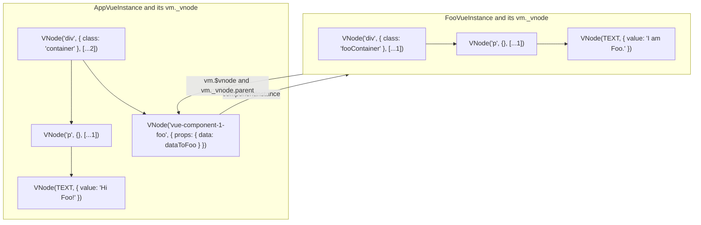

# 组件树的构造

## 文字描述（详细）

### 构造

1. 根组件：`const app = (new Vue(options)).$mount()`

2. 根组件构造：

   1. run `this._init(options)` to initialize the component instance
      1. run `this.$options = mergeOptions(Vue, options)` to merge the options with the Vue's preset options
      2. run `initLifecycle(this)` to set up the parent-child relationship in components chain and some flags to indicate the inactive, mounted and destroyed status of the component
      3. run `initEvents(this)` to create an events pool and initialize the listeners passed from options if existed
      4. run `initRender(this)` to set these `_vnode`, `_staticTrees`, `$slots`, `$scopedSlots`, `_c` and `$createElement` attributes and methods
      5. call `beforeCreate` hook
      6. run `initState(this)` to make its props and data reactive, and initialize all computeds and user-watches, and save all methods
      7. call `created` hook
   2. run `this.$mount()` to execute actual render for getting the rendered dom
      1. call `compileToFunctions(template)` for create a render function in runtime if no render in options found
      2. run `this.mountComponent()`
         1. call `beforeMount` hook
         2. create the `updateComponent` function = `() => this._update(this._render())`
         3. run `this._renderWatcher = new Watcher(this, updateComponent, noop, { before(){ this.isMounted && this.callHook('beforeUpdate') } })`
            1. initialize a watcher for render
            2. run `watcher.get()` to execute its effect
               1. call the `updateComponent` function
                  1. call `this._render()` to save the current VNodesTree as oldVNode and get the latest VNodesTree as newVNode, and while reading each value triggers the dependencies collecting
                     1. if meeting the VNode represented a dom, just return `new VNode(tagName, data, context, children)`
                     2. if meeting the VNode represented a component
                        1. run `createComponent(options, data, context, children)`
                        2. if `options.constructorCached` existed just return the component constructor from the cache
                        3. run `newConstructor = Vue.extend(options)` to get the constructor of the component inherit from Vue
                        4. run `newConstructor.options = mergeOptions(Vue, options)` to get its merged options
                        5. install snabbdom hooks(init, prepatch, insert and destroy) on the VNode
                        6. return `new VNode('vue-component-{componentConstructorId}-{componentName}', data, context, [], componentOptions)`
                  2. call `this._update(newVNode)` to begin the diff and patch
                     1. run `this.$el = this.__patch__(null, newVNode)` for the first patch
                        1. traverse the `newVNode` and call `createElm(currentVNode)` to create the whole VNodesTree
                           1. if currentVNode is a dom VNode, just create it and then save on `VNode.elm` and insert into its parent
                           2. if currentVNode is a component VNode
                              1. run `createComponent(VNode)` -> run `VNode.data.init` hook -> run `createComponentInstanceForVNode(VNode, context)` -> run `VNode.componentOptions.constructor({ parentVNode: VNode, parent: context })` to get the component instance -> set the instance on `VNode.componentInstance`
                              2. run `VNode.componentInstance.$mount()` to get the component's rendered dom that be set on `instance.$el`
                              3. set the `instance.$el` on `VNode.elm`
                              4. insert the returned dom into its parent
         4. return the rendered dom `$el`
         5. call `mounted` hook

3. 替换：`document.querySelector('#app').replaceWith(app.$el)`

### 更新

1. when the data changed and then trigger its all watchers
2. the RenderWatcher called
3. re-run the function `updateComponent`
4. run `__patch__(oldVNode, newVNode)`
   1. if meeting the VNode represented a dom
      1. diff and patch it deeply
   2. if meeting the VNode represented a component
      1. run its `prepatch` hook
         1. run `newVNode.componentInstance = oldVNode.componentInstance` to keep the instance alive
         2. run `updateComponent(newVNode.componentInstance, newVNode, newAttrs, newProps, newListeners, newSlots)` to trigger the component's update if needed
5. call `updated` hook

### 销毁

1. run `instance.$destroy()`
   1. call `beforeDestroy` hook
   2. run `removeSelf(this.$parent?.$children, this)` to remove itself from its parent
   3. run `this._renderWatcher.teardown()` and `this._watchers.teardown()` to teardown its all watchers
   4. run `this.__patch__(this._vnode, null)` to clear its rendered dom, and will destroy all its children components recursively in this stage
   5. run `this.$off()` to unlisten its all listening events
   6. set `_isDestroyed` flag to true
   7. call `destroyed` hook

### 其中父子组件的索引关系：`_vnode` 与 `$vnode`

`_vnode`: 表示渲染 VNode，组件自己 render 函数返回的 VNodesTree。

`$vnode`: 表示占位 VNode，子组件在父组件 VNodesTree 里的 VNode 标识符，即诸如`<vue-component-id-name>`标签名的 VNode，它的`.componentOptions`包含子组件的基本构造信息，它的`.componentInstance._vnode`指向子组件的渲染 VNode（即 VNodesTree）。

两者是父子关系，即`vm._vnode.parent === vm.$vnode`。

图示：

`App.vue`:

```vue
<template>
  <div class="container">
    <p>Hi Foo!</p>
    <Foo :data="dataToFoo"></Foo>
  </div>
</template>
```

`Foo.vue`:

```vue
<template>
  <div class="fooContainer">
    <p>I am Foo.</p>
  </div>
</template>
```


