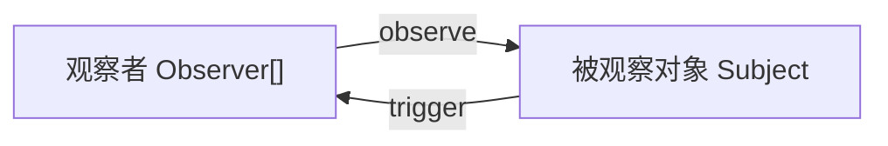
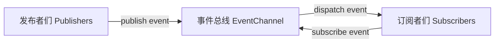

# 观察者模式与发布订阅模式（事件总线）

两者都是常见的设计模式。

## 观察者模式

一（被观察对象）对多（观察者们）的关系。

- 观察者 Observer：观察者
- 被观察对象 Subject：一个需要被观察者观察的目标

观察者和被观察对象相互耦合，观察者知道它观察的对象是谁，被观察对象也知道它被多少观察者观察着。

[代码示例](./code/ObserverAndPubSub/ObserverMode.html)。

## 发布订阅模式（事件总线）

发布者 和 订阅者 是多对多的关系，而 事件总线 和 发布者或订阅者 的关系是一对多。

发布者和订阅者相互不关联，它们的通信都被事件总线代理着，彼此都不知道对方是谁。

在观察者模式下，观察者可主动地获取被观察对象的当前状态，而在发布订阅模式下行不通，订阅者总是被动地接收它订阅的事件。

观察者模式 + 代理 = 发布订阅模式

[代码示例](./code/ObserverAndPubSub/PubSubMode.html)。
