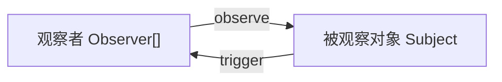
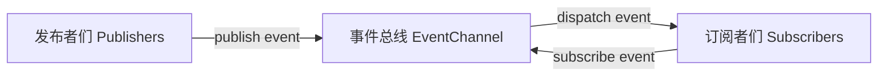

# 观察者模式与发布订阅模式（事件总线）

两者都是常见的设计模式。

## 观察者模式

一（被观察对象）对多（观察者们）的关系。

观察者 Observer：观察者
被观察对象 Subject：一个需要被观察者观察的目标

观察者和被观察对象相互耦合，观察者知道它观察的对象是谁，被观察对象也知道它被多少观察者观察着。



代码示例：

```js
class Subject {
  constructor(name) {
    this.id = `subject_${name}`
    this.data = {
      whoami: this.id,
      // subject's data here
    }
    this.observers = []
  }
  /**
   * add a observer
   * @param {Observer} observer
   * @param {boolean} immediate
   */
  addObserver(observer, immediate) {
    this.observers.push(observer)
    this.trigger('addObserver', observer)
    if (immediate) {
      const sentData = {
        eventData: this.observers,
        data: this.data,
      }
      observer.update('immediate', sentData)
    }
  }
  /**
   * delete a observer
   * @param {Observer} observer
   */
  delObserver(observer) {
    const foundIndex = this.observers.indexOf(observer)
    if (foundIndex == -1) return
    this.observers.splice(foundIndex, 1)
    this.trigger('delObserver', observer)
  }
  /**
   * trigger all observers
   * @param {string} eventName
   * @param {any?} data
   */
  trigger(eventName, data) {
    const sentData = {
      eventData: data,
      data: this.data,
    }
    this.observers.forEach((ob) => ob.update(eventName, sentData))
  }
  /**
   * when subject's data changed
   * @param {string} whichChanged
   */
  onDataChanged(whichChanged) {
    this.trigger('dataChanged', whichChanged)
  }
}

class Observer {
  constructor(name) {
    this.id = `observer_${name}`
    this.target = null // 观察的目标
    this.callback = null
  }
  /**
   * observe a subject
   * @param {Subject} subject
   * @param {Function} callback
   * @param {boolean} immediate
   */
  observe(subject, callback, immediate) {
    this.unobserve()
    this.target = subject
    this.callback = callback
    this.target.addObserver(this, immediate)
  }
  /**
   * unobserve a subject
   * @param {Subject} subject
   */
  unobserve(subject) {
    if (this.target) {
      // remove me from subject first
      this.target.delObserver(this)
      this.target = null
    }
  }
  /**
   * get the observed subject
   * @return {Subject}
   */
  getSubject() {
    return this.target
  }
  /**
   * triggered by subject or itself
   * @param {string} eventName
   * @param {any?} data
   */
  update(eventName, data) {
    this.callback?.(eventName, data)
  }
}

// demo
{
  const subjectAA = new Subject('AA')

  const observer11 = new Observer('11')
  const observer22 = new Observer('22')

  // 由于观察者直接观察一个被观察对象，因此两者都知道彼此的存在
  observer11.observe(subjectAA, (eventName, data) => {
    console.log(
      `observer11: A ${eventName} event received, and the sent data is`,
      data
    )
  })
  observer22.observe(
    subjectAA,
    (eventName, data) => {
      console.log(
        `observer22: A ${eventName} event received, and the sent data is`,
        data
      )
    },
    true
  )

  console.log(
    "observer11's current observed subject is",
    observer11.getSubject()
  )

  observer22.unobserve(subjectAA)

  subjectAA.onDataChanged('An unknown item changed')
}
```

## 发布订阅模式（事件总线）

发布者 和 订阅者 是多对多的关系，而 事件总线 和 发布者或订阅者 的关系是一对多。

发布者和订阅者相互不关联，它们的通信都被事件总线代理着，彼此都不知道对方是谁。

在观察者模式下，观察者可以主动获取被观察对象的当前状态，而在发布订阅模式下行不通，因为订阅者总是被动地接收它订阅的事件。

观察者模式 + 代理 = 发布订阅模式



代码示例：

```js
class Publisher {
  /**
   * @constructor
   * @param {string} name
   * @param {EventChannel} eventChannel - where the publisher registered on
   */
  constructor(name, eventChannel) {
    this.id = `publisher_${name}`
    this.eventChannel = eventChannel
    this.data = {
      // some data
      whoami: this.id,
    }
  }
  /**
   * publish an event
   * @param {string} eventName
   * @param {any?} data
   */
  publish(eventName, eventData) {
    const sentData = {
      eventData,
      data: this.data,
    }
    this.eventChannel.dispatchEvent(eventName, sentData)
  }
}

class Subscriber {
  /**
   * @constructor
   * @param {string} name
   * @param {EventChannel} eventChannel - where the subscriber listening on
   */
  constructor(name, eventChannel) {
    this.id = `subscriber_${name}`
    this.eventChannel = eventChannel
    this.subscribedEvents = []
  }
  /**
   * subscribe an event
   * @param {string} eventName
   * @param {Function} callback
   */
  subscribe(eventName, callback) {
    if (this.subscribedEvents.find((ev) => ev.eventName == eventName)) {
      throw 'The event has been subscribed.'
    }
    this.eventChannel.subscribeEvent(eventName, this)
    this.subscribedEvents.push({
      eventName,
      callback,
    })
  }
  /**
   * unsubscribe an event
   * @param {string} eventName
   */
  unsubscribe(eventName) {
    const foundIndex = this.subscribedEvents.findIndex(
      (ev) => ev.eventName == eventName
    )
    if (foundIndex == -1) return
    this.eventChannel.unsubscribeEvent(eventName, this)
    this.subscribedEvents.splice(foundIndex, 1)
  }
  /**
   * @param {string} eventName
   * @param {any?} data
   */
  update(eventName, data) {
    const filterEvs = (ev) => ev.eventName == eventName
    const doEv = (ev) => ev.callback(data)
    this.subscribedEvents.filter(filterEvs).forEach(doEv)
  }
}

class EventChannel {
  constructor() {
    this.eventPool = {} // 事件池
  }
  /**
   * a subscriber want to subscribe a event
   * @param {string} eventName
   * @param {Subscriber} subscriber
   */
  subscribeEvent(eventName, subscriber) {
    const pool = this.eventPool
    if (pool[eventName]) {
      pool[eventName].push(subscriber)
    } else {
      pool[eventName] = [subscriber]
    }
  }
  /**
   * a subscriber want to unsubscribe a event
   * @param {string} eventName
   * @param {Subscriber?} subscriber
   */
  unsubscribeEvent(eventName, subscriber) {
    const pool = this.eventPool
    if (pool[eventName]) {
      if (subscriber) {
        const targetEvents = pool[eventName]
        const foundIndex = targetEvents.indexOf(subscriber)
        if (foundIndex) {
          targetEvents.splice(foundIndex, 1)
        }
      } else {
        pool[eventName].length = 0
      }
    }
  }
  /**
   * @param {string} eventName
   * @param {any?} data
   */
  dispatchEvent(eventName, data) {
    const pool = this.eventPool
    const found = pool[eventName]
    if (found) {
      // 事件的发布常常由消息队列完成，大多都是异步的形式
      found.forEach((sub) => sub.update(eventName, data))
    }
  }
}

// demo
{
  // 由于代理 ec 的存在，发布者和订阅者不能知道彼此的存在
  const ec = new EventChannel()

  const publisherAA = new Publisher('AA', ec)
  const publisherBB = new Publisher('BB', ec)

  const subscriber11 = new Subscriber('11', ec)
  const subscriber22 = new Subscriber('22', ec)

  subscriber11.subscribe('TotalChanged', (data) => {
    console.log(
      `subscriber11 received TotalChanged event and the data is ${JSON.stringify(
        data
      )}`
    )
  })
  subscriber11.subscribe('VolumeChanged', (data) => {
    console.log(
      `subscriber11 received VolumeChanged event and the data is ${JSON.stringify(
        data
      )}`
    )
  })

  subscriber22.subscribe('VolumeChanged', (data) => {
    console.log(
      `subscriber22 received VolumeChanged event and the data is ${JSON.stringify(
        data
      )}`
    )
  })

  setTimeout(() => {
    publisherAA.publish('TotalChanged', 200)
    publisherBB.publish('TotalChanged', 400)
  }, 1e3)
  setTimeout(() => {
    publisherAA.publish('VolumeChanged', 0.4)
    publisherBB.publish('VolumeChanged', 0.8)
  }, 2e3)
}
```
