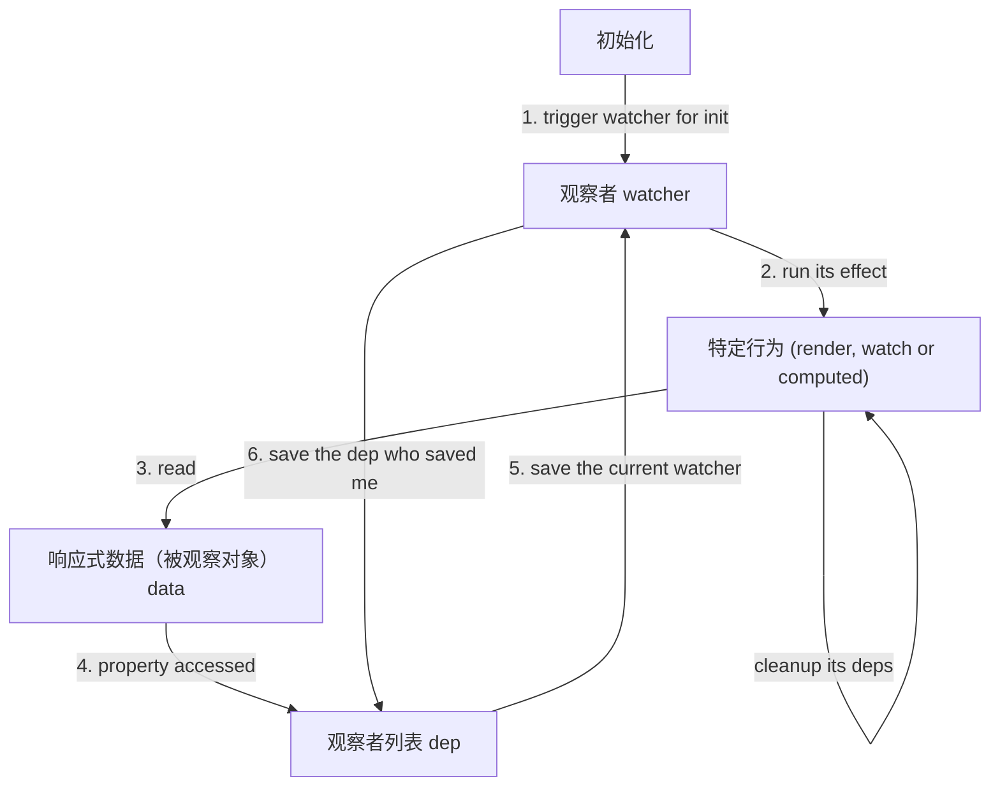

# 响应式系统与副作用

## 什么是副作用

定义：函数或表达式的行为依赖或影响外部数据，具体的：

1. 函数或表达式读或写了它作用域外的状态
2. 函数或表达式除了返回值，还有其他的与外部的交互行为

案例：

```js
const Foo = () => {
  // 违反 1
  window.fooCalled = true
  // 违反 2
  const runTime = Date.now()
  // 违反 2
  console.log(`Foo Called at ${runTime}.`)
  // 正常
  const res = [1, 2, 3, 4].reduce((acc, cur) => acc + cur, 0)
  return res
}
```

## Vue 依赖收集与触发的观察者模式图例

在一些特定语义下，一些词语具有相同的意思。

当【被观察对象】是【数据】时，那么该【被观察对象】的【观察者们】也就是该数据的【依赖们】。

```js
const data = {
  name: 'jack',
  age: 22,
  addr: {
    doorNumber: 108,
    cityPath: ['浙江省', '宁波市', '江北区', 'ABCD街道'],
  },
}

// 把 data 里的值都赋能一个 observer
// 【值】【改变】触发的【行为】就是【依赖】
// 【observer】【改变】触发的【行为】就是【watcher】
// 因此，Vue2 的每个值闭包里的 dep 其实就是此值 observer 的观察者们的列表，即此值的依赖们
// 对于观察者来说，被观察对象就是它的依赖
// dep = dependenciesList = watchersList
// 在此语义下，值 = observer，依赖 = watcher
observe(data)
/**
 * data
 * .name with observer
 * .age with observer
 * .addr with observer
 *  .doorNumber with observer
 *  .cityPath with observer
 */
```



之所以 watcher 也要收集 dep，是因为当一个 watcher 被注销时，需要把它自己从收集它的 deps 里清除（或告诉收集它的 deps 清除它）。

## 实现基本的 Vue2 的响应式系统

```js
// constants
const empty = undefined
const arrProto = Array.prototype

// utils
/**
 * wrapper for Object.defineProperty
 * @param {Object} target
 * @param {string | number | Symbol} key
 * @param {boolean} enumerable
 * @param {any | Function} value - a value or a value getter
 * @param {Function} setter
 * @return {target}
 */
const defProp = (target, key, enumerable, value, setter) => {
  const sameCfg = {
    configurable: true,
    enumerable,
  }
  if (typeof value == 'function') {
    return Object.defineProperty(target, key, {
      ...sameCfg,
      get: value,
      set: setter,
    })
  } else {
    return Object.defineProperty(target, key, {
      ...sameCfg,
      writable: true,
      value,
    })
  }
}
/**
 * check a item is not in the list or not
 * @param {Array} list
 * @param {any} item
 * @return {boolean}
 */
const checkUnexisted = (list, item) => list.indexOf(item) == -1
/**
 * judge a parameter is a plain object or not
 * @param {any} o
 * @return {boolean}
 */
const isObject = (o) => typeof o == 'object' && o !== null
/**
 * generate a path reader for reading an object
 * @param {string} path
 * @return {(target: Object) => any}
 */
const generatePathReader = (path) => {
  const segments = path.split('.').slice(1)
  return (target) => {
    if (!isObject(target)) return empty
    const segmentsCopy = segments.slice()
    let res = target
    while (segmentsCopy.length) {
      const seg = segmentsCopy.shift()
      res = res[seg]
      if (!isObject(res)) {
        // once get a non-object value, stop the whole loop
        if (segmentsCopy.length == 0) {
          // read done
        } else {
          // read error
          res = empty
        }
        break
      }
    }
    return res
  }
}

// the current watcher and its operations
const currentWatcher = {
  stack: [],
  push(watcher) {
    this.stack.push(watcher)
  },
  pop() {
    this.stack.pop()
  },
  get value() {
    // always return the latest watcher in the stack
    const len = this.stack.length
    if (len > 0) {
      return this.stack[len - 1]
    } else {
      return null
    }
  },
}

/**
 * transform a plain data to a reactive data that each value attached `__observer__` instance
 * return a new observer or an existed observer of the data
 * @param {Object} data
 * @return {Observer}
 */
const observe = (data) => {
  /**
   * walk through each value in an object and convert it into getter and setter
   * @param {Object} data
   */
  const observeObject = (data) => {
    Object.keys(data).forEach((key) => defineReactive(data, key))
  }
  /**
   * observe a array deeply
   * @param {Array} data
   */
  const observeArray = (data) => {
    data.forEach((item) => observe(item))
  }
  /**
   * hijack the operations of an array
   * @param {Array} arr
   */
  const hijackArray = (arr) => {
    const methodsToHijack = [
      'push',
      'pop',
      'shift',
      'unshift',
      'splice',
      'reverse',
      'sort',
    ]
    const methodsHijacked = Object.create(arrProto)
    methodsToHijack.forEach((methodName) => {
      const origin = arrProto[methodName]
      methodsHijacked[methodName] = (...args) => {
        // hijack the method
        // apply the origin method and get the result
        const res = origin.apply(arr, args)
        const inserted = []
        // hijacked operations
        switch (methodName) {
          case 'push':
          case 'unshift':
            inserted.push.apply(inserted, args)
          case 'splice':
            inserted.push.apply(inserted, args.slice(2))
        }
        // make new inserted data reactive
        observeArray(inserted)
        // trigger
        this.__observer__.trigger('outsideObserverTrigger')
      }
    })
    // hijack the origin prototype of the arr by inserting the methodsHijacked before its origin prototype
    arr.__proto__ = methodsHijacked
  }
  // begin observing
  if (isObject(data)) {
    if (
      data.hasOwnProperty('__observer__') &&
      data.__observer__ instanceof Observer
    ) {
      return data.__observer__
    } else if (Object.isExtensible(data)) {
      defProp(
        data,
        '__observer__',
        false,
        new Observer('outside', /* test only */ () => data)
      )
      if (Array.isArray(data)) {
        hijackArray(data)
        observeArray(data)
      } else {
        observeObject(data)
      }
      return data.__observer__
    } else {
      throw 'Unknown data found.'
    }
  }
}

/**
 * make a value(target[key]) reactive
 * @param {Object} target
 * @param {string | number | Symbol} key
 * @param {boolean} isShallow
 */
const defineReactive = (target, key, isShallow) => {
  // the actual value of the reactive value
  let value = target[key]

  // an inside observer because it is in a closure of the value
  const observer = new Observer('inside', /* test only */ () => value)

  // an outside observer because it is exposed
  // only exists on an object when isShallow is false
  let observerOutside = !isShallow && observe(value)

  // hijack the getter and setter of the value in order to make it reactive
  defProp(
    target,
    key,
    true,
    () => {
      observer.collect()
      if (observerOutside) {
        observerOutside.collect()
      }
      return value
    },
    (newValue) => {
      if (newValue === value) {
        return
      }
      value = newValue
      observerOutside = !isShallow && observe(newValue)
      observer.trigger('insideObserverTrigger')
    }
  )
}

/**
 * class for Observer
 */
class Observer {
  static id = 0
  static allInstances = []
  /**
   * @param {string} type - type of the observer
   * @param {any} observed - **test only** observed data(value)
   */
  constructor(type, observed) {
    this.id = Observer.id++
    this.type = type
    this.watchersList = []
    {
      // test only
      defProp(this, 'observed', true, observed)
      Observer.allInstances.push(this)
    }
  }
  /**
   * add a watcher into watchersList
   * @param {Object} watcher
   */
  add(watcher) {
    this.watchersList.push(watcher)
  }
  /**
   * remove a watcher from watchersList
   * @param {Object} watcher
   */
  remove(watcher) {
    const index = this.watchersList.indexOf(watcher)
    if (index > -1) {
      this.watchersList.splice(index, 1)
    }
  }
  /**
   * collect the current watcher if exists
   */
  collect() {
    const watcher = currentWatcher.value
    if (watcher && checkUnexisted(this.watchersList, watcher)) {
      // save the current watcher
      this.add(watcher)
      // re-save this watchersList for the current watcher, so they established the two-way relationship
      watcher.addObserver(this)
    }
  }
  /**
   * trigger all watchers in watchersList to update
   * @param {string} whoTriggered
   */
  trigger(whoTriggered) {
    this.watchersList.forEach((w) => w.update(whoTriggered))
  }
}

/**
 * class for Watcher
 */
class Watcher {
  static id = 0
  static defaultOptions = {
    immediate: false,
    deep: false,
  }
  /**
   * @param {Function | string} effect - a effect, a function or a path string
   * @param {Object} context - the context of the effect when running
   * @param {Function} callback - a callback when value of effect generated changed
   * @param {Object} options - options
   * @param {Function} options.before - call before update
   * @param {Function} options.after - call after update
   * @param {boolean} options.immediate - call the callback on first effect run
   * @param {boolean} options.deep - observe deeply for the context
   */
  constructor(effect, context, callback, options) {
    // init instance
    this.id = Watcher.id++
    this.effect =
      typeof effect == 'function' ? effect : generatePathReader(effect)
    this.context = context
    this.callback = callback
    this.options = {
      ...Watcher.defaultOptions,
      ...options,
    }
    this.effectRanCount = 0
    this.active = true
    this.observerList = []
    this.newObserverList = []
    this.value = empty
    // first update for init
    this.update('selfInit')
  }
  /**
   * the update function that will be triggered by observer
   * @param {string} whoTriggered
   */
  update(whoTriggered) {
    // inactive watcher should not be updated
    if (!this.active) {
      throw 'Do Not call update for an inactive watcher.'
    }
    // call before hook if existed
    this.options.before?.(whoTriggered, this)
    // -- update begin --
    const callback = this.callback
    if (whoTriggered == 'selfInit') {
      const immediate = this.options.immediate
      this.run(immediate ? callback : empty)
    } else {
      this.run(callback)
    }
    // -- update end --
    // call after hook if existed
    this.options.after?.(whoTriggered, this)
  }
  /**
   * get the value of the watcher and call its callback if needed
   * @param {Function?} callback
   */
  run(callback) {
    const newValue = this.get()
    const oldValue = this.value
    if (
      newValue !== this.value ||
      // a deep watcher or a watcher on Object should also fire even when the value is the same, because the content of the value may have mutated
      isObject(newValue) ||
      this.deep
    ) {
      // set newValue and call callback with oldValue and newValue if existed
      this.value = newValue
      callback?.(newValue, oldValue)
    }
  }
  /**
   * run its effect and try to get the latest value
   * make itself as current watcher when getting
   */
  get() {
    currentWatcher.push(this)
    const effect = this.effect
    const context = this.context
    let value = empty // the result of calling effect
    try {
      value = effect.call(context, context)
      this.effectRanCount++
    } catch (e) {
      console.warn('An error occurred when executing the watcher effect:')
      console.log(effect)
      console.warn('The error:')
      console.error(e)
    }
    // touch every property so they are all tracked as dependencies for a deep watcher
    if (this.deep) {
      // traverse(value) // traverse should be implemented by user
    }
    currentWatcher.pop()
    this.cleanupObserverList()
    return value
  }
  /**
   * cleanup useless watchersList in observerList comparing by newObserverList
   */
  cleanupObserverList() {
    this.observerList.forEach((list) => {
      // check the old observer is collected me yet or not
      // if not, remove it from the observerList
      if (checkUnexisted(this.newObserverList, list)) {
        // and remove this watcher from the observer who is not collected me now
        list.remove(this)
      }
    })
    // use newObserverList instead of observerList
    this.observerList.length = 0
    this.observerList.push(...this.newObserverList)
    // clear newObserverList
    this.newObserverList.length = 0
  }
  /**
   * add the observer who collected me
   * both add into newObserverList and observerList, because when after called get
   * 1. observerList will be moified only
   * 2. newObserverList will be cleanup always
   * @param {Observer} observer
   */
  addObserver(observer) {
    if (checkUnexisted(this.newObserverList, observe)) {
      this.newObserverList.push(observer)
    }
    if (checkUnexisted(this.observerList, observe)) {
      this.observerList.push(observer)
    }
  }
  /**
   * teardown the watcher
   * remove itself from all things who saved and mark inactive
   */
  teardown() {
    if (this.active) {
      // remove self from all things
      this.observerList.forEach((list) => list.remove(this))
      // mark self as inactive
      this.active = false
    }
  }
}

// test
{
  const testData = {
    name: 'jack',
    age: 22,
    addr: {
      doorNumber: 108,
      cityPath: ['A', 'B', 'C', 'D'],
    },
  }
  observe(testData)
  window.testData = testData

  const effect11 = (data) => {
    console.log(`I am ${data.name} and ${data.age} years old.`)
  }
  const effect11Callback = () => {
    console.log(`effect11's callback: nothing`)
  }

  const effect22 = '.addr.doorNumber'
  const effect22Callback = (newValue, oldValue) => {
    console.log(`effect22's callback: ${oldValue} -> ${newValue}`)
  }

  window.watcher11 = new Watcher(effect11, testData, effect11Callback)
  window.watcher22 = new Watcher(effect22, testData, effect22Callback, {
    immediate: true,
  })
}
```

## RenderWatcher

Vue1.x 的响应式更新以 dom 节点为单位进行更新，在渲染模板时遇到插值表达式或指令就会实例化对应的 watcher，这是一种细粒度的更新，而 Vue2.x 以组件为单位进行更新，传入 watcher 的是组件对应的渲染函数（此 watcher 就是 RenderWatcher），这是一种中粒度的更新。

Vue1.x 的细颗粒更新的主要缺点：

1. 依赖越多需要的 watcher 也越多，消耗内存
2. 仅支持 Web 端
