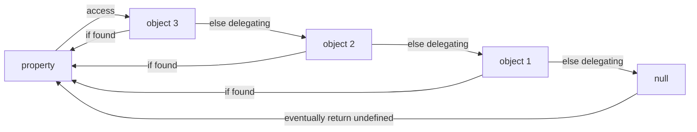

# JavaScript 语言特性

## 闭包

【词法作用域】和【函数一等公民导致】两者导致的副作用，闭包是一个**函数**及其引用的父级**作用域**。

由于词法作用域，闭包在书写函数代码时就被创建了。

## Promise

Promise 目的：使异步任务**可控制可信任**且**高效地链式组合**的技术

传统基于回调函数的异步任务解决方案的缺点：

1. 不可信任，将 callback 传给其他 api，如果此 api 有潜在的 bug 将影响到此 callback，比如此 api 没有正确地执行传给它的 callback
2. callback 的嵌套写法带来的死亡金字塔代码

Promise 如何解决：

1. 创建一个 promise，由此 promise 代理此 api 的状态变更和对应的 callback
2. 支持链式语法

### 为什么 Promise 本身不能取消或不支持取消？

答：Promise 表示的是【给你一个东西，不过这个东西当前还没有值，但是承诺将来一定会有一个值（可能成功可能失败）】，也就是说一个东西已经给到你了，就不存在取不取消的概念了，即便是取消，也是取消【得到这个值的**过程**】，而不是取消这个值本身，而取消【得到的过程】将导致该 Promise 永远不会被决议，再说，如果一个 Promise 被取消，那么它的父 Promise 要取消吗？

## Generator

一个可以被暂停的函数、一个可以被编程的迭代器，JavaScript 里协程的实现。

最佳实践：与 Promise 组合，可以构建**书写简单但健壮的复杂异步操作组合**，这也就是 ES2017 最受关注的`async await`语法糖

## Prototype Chain

The essence of JavaScript's **Prototype Chain is a kind of Delegation Mechanism**.

When an object can't find a property, it will **delegate** its prototype to find the property recursively, and return `undefined` instead if reaches the last prototype (the `null`) of the chain eventually.

```js
const object1 = Object.create(null)
const object2 = Object.create(object1)
const object3 = Object.create(object2)
```



## How `==` works (defined in ES5.1)

`x == y`的行为：

1. x 和 y 是同类型
   1. x 是 undefined，返回 true
   2. x 是 null，返回 true
   3. x 是数字
      1. x 是 NaN，返回 false
      2. y 是 NaN，返回 false
      3. x 和 y 相等，返回 true
      4. x 是 +0，y 是 -0，返回 true
      5. x 是 -0，y 是 +0，返回 true
   4. x 是字符串，序列和 y 完全相等，返回 true
   5. x 是布尔值，y 是它的同类型，返回 true
   6. x 和 y 都指向一个对象，返回 true
2. x 是 null，y 是 undefined，返回 true
3. x 是 undefined，y 是 null，返回 true
4. x 是数字，y 是字符串，返回 x == toNumber(y)
5. x 是字符串，y 是数字，返回 toNumber(x) == y
6. **x 是布尔值，返回 toNumber(x) == y**
7. **y 是布尔值，返回 x == toNumber(y)**
8. x 是字符串或数字，y 是对象，返回 x == toPrimitive(y)
9. x 是对象，y 是字符串或数字，返回 toPrimitive(x) == y
10. 返回 false

备注 1：+0 即 0

备注 2：此处 toPrimitive 的行为

1. 对象是否存在 valueOf 方法，存在的话，返回其执行结果
2. 对象是否存在 toString 方法，存在的话，返回其执行结果
3. 报错

## 元编程

程序在运行时能修改语言自身特性的能力。

1. `Proxy`和`Reflect`能够编写自定义函数来拦截对象的【读、写、枚举、存在性、等等】的语言特性
2. 一些暴露的内置`Symbol`，比如`Symbol.hasInstance`允许自定义`instanceof`操作符的行为

## 从`let`与`const`方向看函数式编程

传统的`let`定义变量，浅语就是让此变量代表一个**内存空间**，不断地修改此内存空间保存的值，最终得出结果。

```ts
// 三角形，底6，高4，求面积
// 面积 = 底 * 高 / 2
let result: number // result表示一个盒子，此盒子放的值将一直演变直到最终的结果
result = 6 // 底
result *= 4 // 底 * 高
result /= 2 // 底 * 高 / 2
console.log(result)
```

函数式的`const`定义常量，浅语就是让此常量代表一个**值**（值本身是不可改变的，能改变的只是内存空间），一个常量只是一次结果的取名。

```ts
// 三角形，底6，高4，求面积
// 面积 = 底 * 高 / 2
const bottom = 6 // 底
const height = 4 // 高
const intermediateArea = bottom * height // 矩形面积（中间结果），对中间结果的取名
const result = intermediateArea / 2 // 结果
console.log(result)
```

# 再快点！JavaScript！

## WebWorker

浏览器的多线程技术。

文档：https://developer.mozilla.org/en-US/docs/Web/API/Worker

## WebAssembly

浏览器的第二可执行语言，类似 Java 的字节码格式，可以从 C C++ Rust GoLang 等语言交叉编译而来。

文档：https://developer.mozilla.org/en-US/docs/WebAssembly
