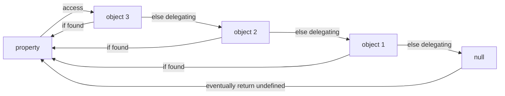

# JavaScript 语言特性

多数内容已经迁移到：<https://github.com/Vladimirirr/Sealeded>

## 闭包

【词法域】和【函数一等公民导致】两者导致的副效果，闭包是一个**函数**及其引到的父级**域**。

由于词法域，闭包在书写函数代码时就被创建了。

## Prototype Chaining

The essence of JavaScript's **Prototype Chaining is a kind of Delegation Mechanism**.

When an object can't find a property, it will **delegate** its prototype to find the property recursively, and return `undefined` instead if reaches the last prototype (the `null`) of the chaining eventually.

```js
const object1 = Object.create(null)
const object2 = Object.create(object1)
const object3 = Object.create(object2)
```



# 再快点！JavaScript！

## WebWorker

浏览器的多线程技术。

文档：https://developer.mozilla.org/en-US/docs/Web/API/Worker

## WebAssembly

浏览器的二号可执行语言，类似 Java 的字节码格式，可以从 C/C++ Rust GoLang 等语言交叉编译而来。

文档：https://developer.mozilla.org/en-US/docs/WebAssembly
