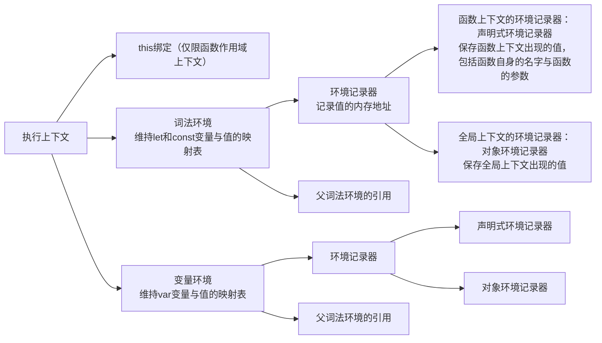

# JavaScript 语言特性

## 闭包

词法作用域和函数一等公民导致的副作用，闭包是一个**函数**及其引用的父级**作用域**（一个或多个，这些作用域被引擎存活）。
由于词法作用域，闭包在书写函数代码时就被创建。

### 出现背景

1. 由于 JavaScript 基于静态作用域（也叫词法作用域），即函数对变量的作用域链查找规则在书写源代码时就决定了，与运行时无关（对应动态作用域），比如：

```js
var name = 'stark'
function foo(otherFunction) {
  var name = 'thor'
  bar()
}
function bar() {
  console.log(`my name is ${name}`)
}

// run bar directly and print 'stark'
bar()

// run bar wrapped with foo and print 'stark' too
foo()
```

多数图灵完备的语言都是静态作用域。
如果是动态作用域，上述示例代码的 foo 执行将打印'thor'而不是'stark'。

2. 由于 JavaScript 将函数作为一等公民，函数就像普通值一样能传来传去（比如当作其他函数的入参、当作其他函数的返回值，此时这个其他函数也便是高阶函数）

### 引出本质

由于上述提到的两点基本前提，也就导致了闭包的出现：

```js
function foo() {
  var statement = 'hi Mr. stark'
  var count = 0
  // 由于foo函数返回值是另一个bar函数，那么foo就叫做高阶函数
  // 由于返回的bar函数在外部可能会被执行，引擎就必须存活statement和count变量，也就是**存活【当前】的foo的函数作用域**
  return function bar() {
    console.log(`${statement} with ${++count} times.`)
  }
}

var fn = foo()
fn() // 'hi Mr. stark with 1 times'
fn() // 'hi Mr. stark with 2 times'

var fn2 = foo() // each foo function will create a **new independent** scope
fn2() // 'hi Mr. stark with 1 times'
fn2() // 'hi Mr. stark with 2 times'
```

由于：

1. 静态作用域：bar 函数对它内部使用到的变量 statement 和 count 的查找作用域链在书写时就被确定
2. JavaScript 是一等公民：bar 函数允许作为 foo 函数的返回值被返回出去

**最终导致：** JavaScript 引擎即便在 foo 函数执行完毕了也要继续存活 foo 函数的作用域，因为此作用域被 bar 函数使用到了，**此时 foo 函数的作用域就叫做【闭包】，而 bar 函数叫做【闭包函数】（拥有闭包的函数）**。

### 验证一个闭包能被多个引用它的函数相互读写

```js
const field = () => {
  var name = 'origin'
  return {
    // 核心：下面的三个方法，使用到的name变量，都来自同一个作用域 —— 当前的field的函数作用域
    a() {
      name = 'aaaa'
    },
    b() {
      name = 'bbbb'
    },
    what() {
      console.log(name)
    },
  }
}

const fieldDo = field()

fieldDo.what() // origin
fieldDo.a()
fieldDo.what() // aaaa
fieldDo.b()
fieldDo.what() // bbbb
fieldDo.a()
fieldDo.what() // aaaa
```

## Promise

Promise 目的：使异步任务**可控制可信任**且**高效地链式组合**的技术

传统基于回调函数的异步任务解决方案的缺点：

1. 不可信任，将 callback 传给其他 api，如果此 api 有潜在的 bug 将影响到此 callback，比如此 api 没有正确地执行传给它的 callback
2. callback 的嵌套写法带来的死亡金字塔代码

Promise 如何解决：

1. 创建一个 promise，由此 promise 代理其他 api 的状态变更和对应的 callback
2. 支持链式语法

### 为什么 Promise 本身不能取消或不支持取消？

答：Promise 表示的是【给你一个东西，不过这个东西当前还没有值，但是承诺将来一定会有一个值（可能成功可能失败）】，也就是说一个东西已经给到你了，就不存在取不取消的概念了，即便是取消，也是取消【得到这个值的**过程**】，而不是取消这个值本身，而取消【得到的过程】将导致该 Promise 永远不会被决议，再说，如果一个 Promise 被取消，那么它的父 Promise 要取消吗？

## Generator

一个可以被暂停的函数、一个可以被编程的迭代器，JavaScript 里协程的实现。

最佳实践：与 Promise 组合，可以构建**书写简单但健壮的复杂异步操作组合**，这也就是 ES2017 最受关注的`async function`语法

## How `==` works (defined in ES5.1)

`x == y`的行为：

1. x 和 y 是同类型
   1. x 是 undefined，返回 true
   2. x 是 null，返回 true
   3. x 是数字
      1. x 是 NaN，返回 false
      2. y 是 NaN，返回 false
      3. x 和 y 相等，返回 true
      4. x 是 +0，y 是 -0，返回 true
      5. x 是 -0，y 是 +0，返回 true
   4. x 是字符串，序列和 y 完全相等，返回 true
   5. x 是布尔值，y 是它的同类型，返回 true
   6. x 和 y 都指向一个对象，返回 true
2. x 是 null，y 是 undefined，返回 true
3. x 是 undefined，y 是 null，返回 true
4. x 是数字，y 是字符串，返回 x == toNumber(y)
5. x 是字符串，y 是数字，返回 toNumber(x) == y
6. **x 是布尔值，返回 toNumber(x) == y**
7. **y 是布尔值，返回 x == toNumber(y)**
8. x 是字符串或数字，y 是对象，返回 x == toPrimitive(y)
9. x 是对象，y 是字符串或数字，返回 toPrimitive(x) == y
10. 返回 false

备注 1：+0 即 0

备注 2：此处 toPrimitive 的行为

1. 对象是否存在 valueOf 方法，存在的话，返回其执行结果
2. 对象是否存在 toString 方法，存在的话，返回其执行结果
3. 报错

## 执行上下文 (defined in ES6)

执行上下文：被执行的函数作用域、块作用域和全局作用域



## 元编程

程序在运行时能修改语言自身特性的能力。

1. `Proxy`和`Reflect`能够编写自定义函数来拦截对象的【读、写、枚举、存在性、等等】的语言特性
2. 一些暴露的内置`Symbol`，比如`Symbol.hasInstance`允许自定义`instanceof`操作符的行为

## 从`let`与`const`方向看函数式编程

传统的`let`定义变量，浅语就是让此变量代表一个**内存空间**，不断地修改此内存空间保存的值，最终得出结果。

```ts
// 三角形，底6，高4，求面积
// 面积 = 底 * 高 / 2
let result: number // result表示一个盒子，此盒子放的值将一直演变直到最终的结果
result = 6 // 底
result *= 4 // 底 * 高
result /= 2 // 底 * 高 / 2
console.log(result)
```

函数式的`const`定义常量，浅语就是让此常量代表一个**值**（值本身是不可改变的，能改变的只是内存空间），一个常量只是一次结果的取名。

```ts
// 三角形，底6，高4，求面积
// 面积 = 底 * 高 / 2
const bottom = 6 // 底
const height = 4 // 高
const intermediateArea = bottom * height // 矩形面积（中间结果），对中间结果的取名
const result = intermediateArea / 2 // 结果
console.log(result)
```

# WeakMap and WeakSet

WeakMap 仅接收对象作为键。对象被弱持有，意味着如果对象本身被垃圾回收掉，那么在 WeakMap 中的记录也会被移除。这是代码层面观察不到的。
同理，WeakSet 只是弱持有它的值。

由于随时可能给 GC 回收，故不能得到它当前的 items 长度，也不能迭代它。

# WebAssembly

`asm.js` + `simd.js` --evolved--> `WebAssembly`

`asm.js` is an extraordinarily optimized low-level subset of JavaScript, which only allows things like `while`, `if`, `number`, `top-level named function`, and other simple constructs. This subset of JavaScript is already highly optimized in many JavaScript engines using fancy Just-In-Time(JIT) compiling techniques, such as SpiderMonkey(Firefox), V8(Chrome) and Chakra(IE and old Edge).

`simd.js` is the Single Instruction and Multiple Data technique implemented on JavaScript.

WebAssembly is a low-level assembly-like language that can be compiled into a compact binary format like bytecode of Java, which runs on modern JavaScript engines directly, and also provides languages such as `C/C++`, `Golang` and `Rust` with a cross-compilation target so that they can run on the web.
WebAssembly is designed to complement and run alongside with JavaScript, and they communicate easily.

Emscripten is a complete Open Source compiler toolchain to WebAssembly like Binaryen. Using Emscripten you can:

1. Compile C/C++ code, or any other language that uses LLVM, into WebAssembly, and run it on the Web, Node.js, or other wasm runtimes.
2. Compile the C/C++ runtimes of other languages into WebAssembly, and then run code in those other languages in an indirect way (for example, this has been done for Python and Lua).

翻译：

1. 将 C/C++ 代码或任何其他使用 LLVM 的语言编译为 WebAssembly，并在 Web、Node.js 或其他 wasm 运行时上运行这些代码。
2. 将其他语言的 C/C++ 运行时编译为 WebAssembly，最终间接地运行这些语言的代码（例如，Python 和 Lua 已经这样做了）。

比如 Python 要交叉编译到 webassembly，其实是把 CPython（C 语言实现的 Python 编译器）编译到成对应的 wasm，在基于此 wasm 的运行时上执行 Python 代码。(Because Python is not a language that can not be compiled to native code.)

# WebWorker

**下面的 worker 均指 WebWorker（也叫专用 worker），与 ShareWorker 、 ServiceWorker 、 AudioWorker 及其他的 worker 相区分。**

**WebWorker 是真正的操作系统级别的线程。**

### 构造器

```js
new Worker(workerPath, ?options)
// workerPath：需要加载的worker的脚本路径（可以是本页面创建的BlobURL），必须返回有效且同源的JavaScript的mime类型，比如text/javascript
// options: {
//   type: 'classic' | 'module' = 'classic', // worker的类型，对于Chrome>=80支持module，从而在worker之间使用标准的模块化编程，而Firefox目前的最新版本102依旧不支持
//   name?: string, // 此worker的名字，方便调试
//   credentials？: 'omit' | 'same-origin' | 'include' = 'omit' // 指定凭证，如果是classic的worker默认moit，即不需要凭证
// }

```

### 数据传递

worker 的 postMessage 传递的是数据的副本（传值而非传址），数据使用[**结构化克隆算法**](https://developer.mozilla.org/en-US/docs/Web/API/Web_Workers_API/Structured_clone_algorithm)进行拷贝和传递，结构化克隆算法可以简单地理解为升级版的 JSON 算法，因为它还能传递 JS 的特殊数据类型（函数、Symbol、等），还可以解决循环引用的问题。

不过可以通过 postMessage 的第二个参数开启传址方式（传递一个对象的引用），即转让一个对象。

### 限制访问

- worker 运行在独立的上下文（有自己独立的事件循环），worker 内部的全局对象不是 window，也不包含 window，使用 self 或全局的 this 来访问 worker 的[全局对象(DedicatedWorkerGlobalScope)](https://developer.mozilla.org/en-US/docs/Web/API/DedicatedWorkerGlobalScope)
- 除了不能直接操作父页面的 dom 及其相关操作，其他常用的浏览器 API 都能使用，比如 AJAX（不过返回的 response 的 responseXML 总是 null）、fetch、websocket、indexedDB、setTimeout、等等，但是 localStorage 和 sessionSorage 不能用，可以在此查看[具体的清单](https://developer.mozilla.org/en-US/docs/Web/API/Web_Workers_API/Functions_and_classes_available_to_workers)

### 导入脚本

语法：`[self.]importScript(path1, path2, ...)`

在 worker 内部引入脚本（即在当前的 worker 环境内执行此脚本，相当于 C 语言的`#include`）。

将同时下载多个脚本，但是执行顺序严格按照书写顺序，且 importScript 是同步执行，只有当全部的脚本执行完才释放 JS 控制权。

### 子 worker

在 worker 内部可以继续生成 worker（路径解析相当于父 worker 而非根页面），但必须与跟页面同源，即全部的 worker 都需要与根页面同源。

### 其他

workerInstance.terminate 方法：立刻终止此 worker，不会给 worker 留下剩余的操作机会

onmessageerror 事件：当此 worker 无法解析收到的数据时
