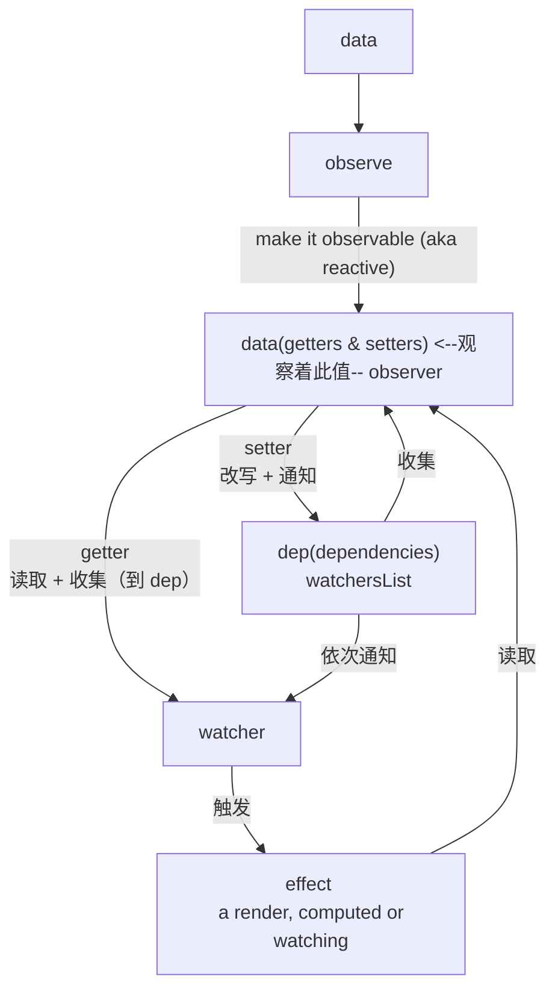
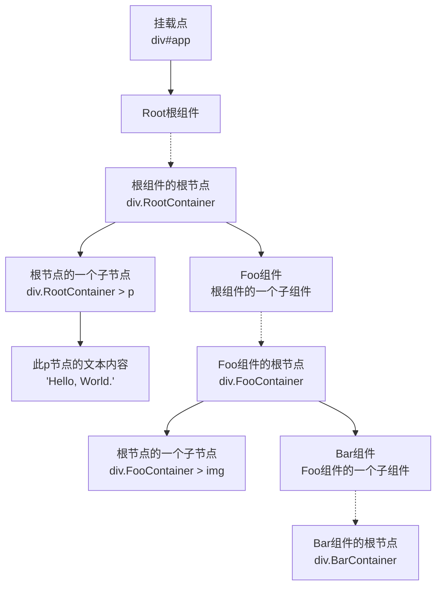

# 目录

## -1、前言

> 本系列文章从宏观方向阐述了 Vue2.x 的基本实现思想，是 Vue 实现思想的入门教程。深入一门技术时，整体方向是最重要的，一旦方向是对的，剩下的就是时间问题（比如，一些内置函数的具体实现）。

> 尽管现在 Vue 已经全系到了 Vue3.x，但是最核心的【响应式思想】换汤不换药，Vue3.x 可以概况到：
>
> 1. 提高了响应式的性能：defineProperty -> Proxy
> 2. 提高了从模板转译而来的 render 函数的性能：更强的静态优化策略
> 3. 提高了代码的可维护性：引入组合式语法，从面向对象到投抱函数式，根本上降低了 mixin 和 HOC 带来的混乱

## 0、整体设计思想

### 响应式的系统

### 组件树的组合

备注：

1. 实线：DOM 树里真实节点间的索引
2. 点线：Vue 组件在 DOM 树里透传其内部 DOM 节点们的暗示

## 1、命令式与声明式

[Open.](./TheWriteMode.md)

## 2、响应式的数据

[Open.](./ReactiveData.md)

## 3、观察者模式与发布订阅模式（事件总线）

[Open.](./ObserverAndPubSub.md)

## 4、Template 与 JSX

[Open.](./TemplateAndJSX.md)

## 5、响应式系统与副效果

[Open.](./ReactiveSystemWithEffect.md)

## 6、渲染器

[Open.](./Renderer.md)

## 7、组件

[Open.](./Component.md)

## 8、Async 组件

[Open.](./AsyncComponent.md)

## 9、组件树的构造

[Open.](./BuildComponentsTree.md)

## 10、事件循环与更新优化

[Open.](./EventLoopAndBetterUpdate.md)

## 11、其他

[Open.](./Others.md)

## 12、JavaScript 语言特性

[Open.](./TheJS.md)
